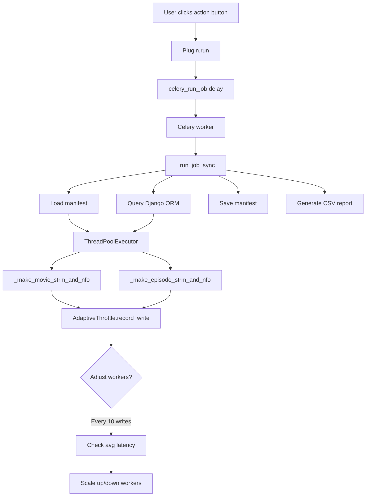

# vod2strm – Dispatcharr Plugin

## Project Overview

A high-performance Dispatcharr plugin that exports VOD libraries (Movies and Series/Episodes) into structured filesystems of `.strm` and `.nfo` files for Plex, Emby, Jellyfin, or Kodi. Runs entirely inside Dispatcharr using Django ORM for data access and Celery for background jobs.

**Key Features:**
- Generate `.strm` proxy files pointing to Dispatcharr's VOD endpoints
- Create NFO metadata files with TMDB/IMDB information
- Manifest-based caching to skip unchanged files (protects NAS/SD cards)
- Adaptive throttling that monitors NAS performance and adjusts concurrency
- Cleanup mode to remove stale files when content is deleted
- Scheduled runs via Celery beat
- Auto-run after VOD refresh with debouncing

**Current Version:** `0.0.2`

## Technology Stack

### Backend
- **Framework:** Django plugin for Dispatcharr
- **Language:** Python 3.x
- **ORM:** Django ORM for database access
- **Task Queue:** Celery
- **Database:** PostgreSQL (Dispatcharr's database)

### Key Libraries
- `concurrent.futures.ThreadPoolExecutor` - File I/O parallelization
- `xml.etree.ElementTree` - NFO XML generation
- `pathlib.Path` - Filesystem operations
- `celery.shared_task` - Celery task registration

### Models (from Dispatcharr)
- `Movie` - Movie metadata (fields: `name`, `year`, `uuid`, `tmdb_id`, `imdb_id`)
- `Series` - TV series metadata (fields: `name`, `year`, `uuid`, `tmdb_id`)
- `Episode` - Episode metadata (fields: `name`, `season_number`, `episode_number`, `uuid`)

## Project Structure

<!-- anchor: project-structure -->

```text
vod2strm/
├── __init__.py              # Plugin registration, exports Plugin class
├── plugin.py                # Main plugin implementation (~1400 lines)
├── CLAUDE.md                # This file - project context for Claude
├── README.md                # User-facing documentation
└── .claude/
    └── instructions.md      # Session-persistent workflow rules
```

### Key Code Sections (plugin.py)

| Lines | Section | Purpose |
|-------|---------|---------|
| 1-55 | Imports & Constants | Django models, Celery, defaults |
| 56-148 | Manifest & Throttle | Caching logic, adaptive concurrency control |
| 149-230 | Filesystem Helpers | Folder naming, file writing, hash comparison |
| 231-263 | NFO Generation | XML creation for movies, series, episodes |
| 264-460 | STRM Generation | Movie/episode file creation |
| 461-544 | Cleanup Logic | Stale file detection and removal |
| 545-749 | Core Job Functions | `_run_job_sync()`, movie/series processing |
| 750-1042 | Plugin Class | Django plugin interface, actions, settings |
| 1043-1307 | Celery & Signals | Task registration, auto-run triggers |

## Code Conventions

### Django ORM Patterns
- Use `.select_related()` to prevent N+1 queries
- Use `.only()` to fetch specific fields
- Wrap bulk operations in `transaction.atomic()`
- Always check if fields exist with `getattr(obj, 'field', default)`

### File I/O Best Practices
- Always use `Path` objects, never string concatenation
- Call `parent.mkdir(parents=True, exist_ok=True)` before writes
- Use atomic writes (write to temp file, then rename)
- Hash-compare before overwriting (NFO files)
- Track all writes in manifest for caching

### Threading Safety
- Use `threading.Lock()` for shared state (report rows, manifest updates)
- Use `ThreadPoolExecutor` for I/O-bound work
- Limit workers to max 4 (prevents Django DB connection exhaustion)
- Close DB connections in Celery `task_postrun` signal

### Adaptive Throttling Strategy
```python
# Start conservative (1 worker), scale up based on performance
# Check every 10 writes, adjust based on average latency:
#   - If avg > 100ms: cut workers in half
#   - If avg < 30ms: increase workers by 50%
#   - Min: 1, Max: min(user_setting, 4)
```

## Implementation Details

### Manifest Caching (`plugin.py:87-148`)

**Purpose:** Skip writing `.strm` files when content hasn't changed (reduces NAS wear)

**Structure:**
```json
{
  "version": 1,
  "files": {
    "/data/STRM/Movies/Movie (2023)/Movie (2023).strm": {
      "uuid": "550e8400-e29b-41d4-a716-446655440000",
      "type": "movie"
    }
  }
}
```

**Logic:**
- On startup: Load manifest from `{output_root}/.vod2strm_manifest.json`
- During generation: Check if file exists + UUID matches manifest
- On completion: Save updated manifest atomically (write to temp, rename)

### Adaptive Throttling (`plugin.py:151-227`)

**Problem:** Initial implementation started with max workers (4), overwhelming slow NAS devices.

**Solution:**
```python
class AdaptiveThrottle:
    def __init__(self, max_workers: int, enabled: bool = True):
        self.current_workers = 1 if enabled else max_workers  # Start conservative
        self.window_size = 20  # Track last 20 writes
        self.check_interval = 10  # Adjust every 10 writes
        self.slow_threshold = 0.100  # 100ms
        self.fast_threshold = 0.030  # 30ms
```

**Metrics Tracked:**
- STRM write time (measured)
- NFO write time (measured)
- Average latency over rolling window

### Cleanup Logic (`plugin.py:534-670`)

**Modes:**
- `CLEANUP_OFF` - No cleanup
- `CLEANUP_PREVIEW` - Report what would be deleted (no action)
- `CLEANUP_APPLY` - Delete stale files + empty folders

**Process:**
1. Load manifest (tracks all previously written files)
2. Validate each UUID against database (Movie/Episode exists?)
3. Mark invalid UUIDs for deletion
4. Delete associated NFO files (movie.nfo, season.nfo, episode.nfo)
5. Prune empty directories

**Critical Fix:** Cleanup runs BEFORE generation (not after) to prevent race condition where new files get deleted immediately after creation.

### Scheduled Tasks with Celery Beat (`plugin.py:1230-1268`)

**Implementation Pattern:**

This plugin implements scheduled STRM generation using Celery Beat with programmatic task registration (not Django's PeriodicTask model).

**How It Works:**

1. **Task Definition**: Use `@shared_task` decorator to define the scheduled task function:
```python
@shared_task(name="vod2strm.plugin.generate_all")
def celery_generate_all():
    # Load settings from database
    # Execute _run_job_sync with mode="all"
```

2. **Schedule Registration**: Configure Celery Beat schedule programmatically in `Plugin.ready()`:
```python
celery_app.conf.beat_schedule["vod2strm.periodic_generate_all"] = {
    "task": "vod2strm.plugin.generate_all",
    "schedule": {"type": "crontab", "hour": 3, "minute": 30},
    "args": []
}
```

3. **Settings Loading**: Scheduled tasks load their own settings from PluginConfig database:
```python
plugin_config = PluginConfig.objects.filter(key="vod2strm").first()
settings = plugin_config.settings if plugin_config else {}
```

**Key Learnings from EPG Scheduler Plugin:**

- Other scheduler plugins (like EPG refresh) use a different approach - they create Django `PeriodicTask` model instances to schedule **existing** Dispatcharr tasks
- Our plugin defines **custom** tasks using `@shared_task`, giving us more control over execution
- Scheduled tasks must be self-contained - they can't rely on user-provided parameters, so they load settings from the database
- Always set `dry_run=False` for scheduled runs (user wouldn't schedule dry runs)

**Schedule Format Support:**

- **Simple**: `"daily 03:30"` - runs at 3:30 AM every day
- **Crontab**: `"0 3 * * *"` - standard 5-field cron syntax
- **Extended**: `"0 0 3 * * *"` - 6-field with seconds

**Important Notes:**

- Workers must be restarted after plugin installation for beat schedules to register
- Schedule registration happens in `Plugin.ready()` which runs on Django startup
- Task names must match exactly: `"vod2strm.plugin.generate_all"` → `celery_generate_all` function
- Beat scheduler is a separate process from workers (`celery beat` vs `celery worker`)

## Workflow & Git Rules

<!-- anchor: git-workflow -->

### Branch Strategy
- **Main branch is protected** - cannot push directly
- All work happens on feature branches with format: `claude/{description}-{session-id}`
- One logical fix = one branch = one PR
- Create PRs via GitHub API (gh CLI doesn't work with protected main)

### PR Review Process
- **NEVER merge to main without explicit user approval**
- Codex bot automatically reviews PRs on initial push
- Subsequent pushes require comment: `@codex review`
- Review status: 👀 (reviewing), 👍 (passed), Comments (issues found)
- Check PR comments yourself before asking user

### GitHub API Access
```bash
# Create PR via curl
curl -X POST \
  -H "Authorization: token {PAT}" \
  -H "Accept: application/vnd.github.v3+json" \
  https://api.github.com/repos/cmc0619/vod2strm/pulls \
  -d '{"title": "...", "head": "claude/...", "base": "main", "body": "..."}'
```

## Recent Features & Fixes

<!-- anchor: recent-features -->

### Database Cleanup Buttons (Issue #556)
**Location:** `plugin.py:976-1017`

Added UI buttons for development/debugging:
- **Delete ALL Episodes** - Removes all episodes (keeps series)
- Uses Django ORM with `transaction.atomic()`
- Returns detailed deletion counts by model type

### Celery Task Registration Fix (PR #21)
**Location:** `plugin.py:51-55`, `plugin.py:1276-1306`

**Problem:** Tasks were disabled with `if False`, causing warnings.

**Solution:**
- Import `shared_task` from celery module
- Use `@shared_task` decorator directly in plugin.py
- Tasks auto-register when plugin module loads
- Celery is required (Dispatcharr depends on it)

### NAS Overload Protection (PR #21)
**Location:** `plugin.py:162-183`

**Changes:**
- Start with 1 worker instead of max_workers
- Check every 10 writes instead of 50
- More aggressive thresholds (100ms/30ms instead of 200ms/50ms)
- Track NFO writes in addition to STRM writes

### Year Duplication Fix (PR #21)
**Location:** `plugin.py:259-273`

**Problem:** Folder names showed `(1999) (1999)` because `movie.name` already contained year.

**Solution:** Strip existing `(YYYY)` pattern from name before adding `movie.year`:
```python
name = re.sub(r'\s*\(\d{4}\)\s*$', '', name).strip()
```

## Known Issues & Limitations

<!-- anchor: limitations -->

### Current Limitations
- No incremental episode detection (requires manual re-run for new episodes)
- No provider deduplication (if same content on multiple providers, generates multiple files)
- No genre-based folder organization
- Manifest doesn't track file existence (relies on filesystem)

## Protected Areas (Do NOT Touch)

<!-- anchor: protected-areas -->

**Critical Code - Modify with Extreme Caution:**

These areas should NOT be modified by AI without explicit user approval:

### Database Models
- Never modify Django model field names (Movie, Series, Episode)
- Model fields are defined by Dispatcharr, not this plugin
- Always use `getattr(obj, 'field', default)` to safely access fields
- **Known safe fields:**
  - Movie: `name`, `year`, `uuid`, `tmdb_id`, `imdb_id`
  - Series: `name`, `year`, `uuid`, `tmdb_id`
  - Episode: `name`, `season_number`, `episode_number`, `uuid`

### Manifest File Structure
- The manifest JSON schema is critical for caching logic
- Changes to manifest format require migration logic
- Current schema: `{"version": 1, "files": {...}}`

### Threading & Concurrency
- ThreadPoolExecutor worker limits (max 4) prevent DB connection exhaustion
- Adaptive throttling algorithm carefully tuned for NAS protection
- Lock usage patterns prevent race conditions

### Celery Task Registration
- Uses `@shared_task` decorator - the standard Django/Celery pattern for plugins
- Task names match the actual import path: `vod2strm.plugin.run_job`
- Plugin module is added to Celery's imports configuration at module load time
- Tasks auto-register when workers import the plugin module
- Workers must be restarted after plugin installation/updates to pick up changes
- Don't change task signatures without updating callers

## Things NOT to Do

<!-- anchor: things-not-to-do -->

**Critical Rules - Violations Will Break Production:**

### Model/Database
- ❌ **NEVER** query `title` field on Movie model (doesn't exist, use `name`)
- ❌ **NEVER** modify or delete from Dispatcharr's database (read-only plugin)
- ❌ **NEVER** use raw SQL queries (use Django ORM only)
- ❌ **NEVER** assume fields exist (use `getattr(obj, 'field', default)`)

### File Operations
- ❌ **NEVER** run cleanup AFTER generation (causes race condition, deletes new files)
- ❌ **NEVER** skip manifest save on error (causes files to be regenerated every run)
- ❌ **NEVER** write files outside the configured output_root
- ❌ **NEVER** use string concatenation for paths (use `Path` objects)

### Threading/Concurrency
- ❌ **NEVER** start ThreadPoolExecutor with >4 workers (exhausts Django DB connections)
- ❌ **NEVER** modify shared state without locks (manifest, report_rows)
- ❌ **NEVER** block the main Django thread (use Celery for background tasks)

### Git/Deployment
- ❌ **NEVER** merge to main without explicit user approval
- ❌ **NEVER** push directly to main (branch is protected)
- ❌ **NEVER** commit secrets or tokens to the repository
- ❌ **NEVER** modify version numbers without user request

## Future Development

### Incremental Episode Updates (Backlog)
**Problem:** New episodes released after initial generation are never detected.

**Planned Solution:**
1. Enhance manifest to track `episode_count` and `last_refresh` timestamp
2. Add time-based refresh check (if `last_refresh > 24h` → check provider)
3. Compare provider episode count vs manifest count
4. Trigger refresh if different

**Reference implementations:** vodstrmpg, strmvod plugins

### Advanced Optimizations (from vodstrmpg)
- Direct PostgreSQL access (bypass API pagination)
- Provider deduplication by TMDB ID
- Batched TMDB season fetching (reduce API calls)
- Genre-based folder organization

## Environment Setup

### Development
```bash
# Install in Dispatcharr plugin directory
mkdir -p /data/plugins/vod2strm
cp __init__.py plugin.py /data/plugins/vod2strm/

# Restart Dispatcharr to load plugin
systemctl restart dispatcharr
```

### Testing
```bash
# Syntax check
python3 -m py_compile plugin.py

# Enable dry run mode in plugin settings
# Click "Generate All" to test without writing files
```

## Architecture Diagram



## Maintenance Notes

### When to Update This File
- Architecture changes (new models, API changes)
- New features added
- Critical bugs discovered
- Workflow rule changes
- Performance optimizations

### Commit with Code Changes
This file should be updated and committed alongside relevant code changes to maintain accuracy.

---

**Last Updated:** 2025-11-10
**Current Session:** PR #21 - Celery task registration and NAS throttling fixes
